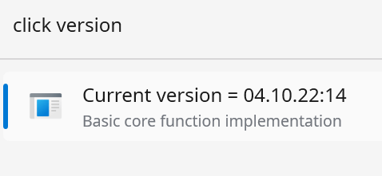

# Flow.Launcher.Plugin.FlClicker
## Attention: preliminary testing only! DO NOT USE - NOT READY YET!

---

## Purpose
## Vision Statement
The FlClicker named FlowLauncher Plugin provides commands for the fast and efficient execution of regular ClickUp.com related project management activities such as 

1. **adding a new task** to the inbox: > *click "this is my new task" prio1*
2. **display the current inbox**: > *click inbox*
3. **show details of a task** with ID = 122: > *click T122*

Tasknumbers are autocreated and existing ClickUp accounts and tasklists can be configured in the plugin's settings. 

## Purpose
The primary goal is to **keep your work-flow alive** and therefore to **reduce distractions** in a way, that ad-hoc input (ideas, duties, calls, etc.) that come spontanously to your attention can be most efficiently jotted down, to get - within max 2 seconds - your head free and focused again on the currently scheduled activities without leaving your hands yoru keyboard.

## Features
The only features we have publicly opened for testing is the display of the FlClicker's internal version number when typing "click version". 

**"click" will remain our preferred keyword** to start everything FlClicker-related. Neither commands nor parameters are case-sensitive.

### Version
**"click version"** displays the current version number: 

Currently, during preliminary framework testing phase, the version displays the compilation-time and -date of the currently compiled code bvase. This will change to SemVer-Versioning with the first "public" release beginning with v0.1.x. 

## Releases
**Current, still UNSTABLE Test-Release is v0.0.5.**. 

**It is for Initial round-trip framework testing: do not use!**:

More about releases in the [FlClicker **Release Notes**](docs/FlClicker_Release_Notes.md). 

Warning:
The current relase is **only for TECHNICAL end2end integration testing**. Goal is to check wether the Plugin-Project's Framework automation works, is accepted by the FlowLauncher-authorities and therefore "goes through" before we are adding a bulk of functionality.  

The current **functionality is neither complete**, nor can users modify their own settings. The current version runs again a dedicated ClickUp Test-Account that is NOT shared with the public!

