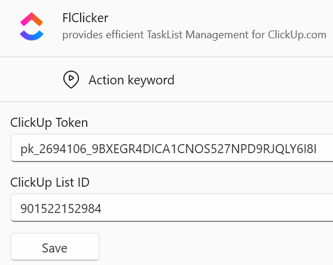

# SettingsControl.xaml

This file defines the l**ayout (visual) of** the SettingsControl that will be used by the **FlowLauncher-Plugin-Mangere's Settings Screen**. 

Together the two files define the Layout (.xmal) and functionality (.xaml.cs) of the **FlClicker Plugin's Settings Panel**: 




## The Code

```xml
<UserControl x:Class="SettingsControl"
             xmlns="http://schemas.microsoft.com/winfx/2006/xaml/presentation"
             xmlns:x="http://schemas.microsoft.com/winfx/2006/xaml"
             MinWidth="420">
    <StackPanel Margin="12">
        <TextBlock Text="ClickUp Token"
                   Margin="0,0,0,4"/>
        <TextBox x:Name="ClickUpTokenTextBox"
                 Margin="0,0,0,12"/>

        <TextBlock Text="ClickUp List ID"
                   Margin="0,0,0,4"/>
        <TextBox x:Name="ListIdTextBox"
                 Margin="0,0,0,12"/>

        <Button Content="Save"
                Width="100"
                HorizontalAlignment="Left"
                Click="SaveButton_Click"/>
    </StackPanel>
</UserControl>
```
