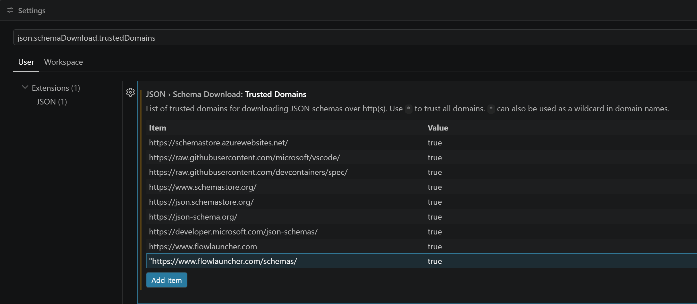

# plugin.json

* **[FlClicker-badecafe-8037-1965-2026-a04b12c09d10.json](../../plugins/FlClicker-badecafe-8037-1965-2026-a04b12c09d10.json.md)**

---

The mandatory **plugin.json** file **in the project's /src folder** is the local PluginsManifest files for your local plugin testing and is **NOT identical with the [GLOBAL PluginsManifest file!](../../plugins/FlClicker-badecafe-8037-1965-2026-a04b12c09d10.json.md)**

It is required for your locally installed Flowlauncher.exe to understand how to communicate with your plugin. 

> <span style="color:red; font-weight:bold">Attention</span>: **This files is NOT identical with the "[FlClicker badecafe 8037 1965 2026 a04b12c09d10.json](../../plugins/FlClicker-badecafe-8037-1965-2026-a04b12c09d10.json.md)"-named PluginsManifestation file**, which you need to publish to the FlowCharter Repo [FlClicker badecafe 8037 1965 2026 a04b12c09d10.json](../../plugins/FlClicker-badecafe-8037-1965-2026-a04b12c09d10.json.md) to let users and FlowLauncher know publicly from where to load your Plugin!  
> However **make sure, that the identical fields will contain identical values**!

---

## The Code
```json
{
    "$schema": "https://www.flowlauncher.com/schemas/plugin.schema.json",
    "ID": "badecafe-8037-1965-2026-a04b12c09d10",
    "ActionKeyword": "click",
    "Name": "FlClicker",
    "Description": "provides efficient TaskList Management for ClickUp.com",
    "Author": "realB12",
    "Version": "0.0.6",
    "Language": "csharp",
    "Website": "https://github.com/realB12/Flow.Launcher.Plugin.FlClicker",
    "IcoPath": "Images\\Images/ClickUpIcon_256x256.png",
    "ExecuteFileName": "Flow.Launcher.Plugin.FlClicker.dll"
}
```

with the following **fields**: 
```json
{
  "ID":"",             //Plugin ID，32 bit UUID
  "ActionKeyword":"",  //Plugin default action keyword (* means no specific action keyword)
  "Name":"",           //Plugin name
  "Description":"",    //Plugin description
  "Author":"",         //Plugin Author
  "Version":"",        //Plugin version (e.g. 1.0.0). It is important for plugin update checking.
  "Language":"",       //Plugin language，available fields are csharp, fsharp, python, javascript, typescript and executable. Make sure you put the correct field for your plugin language, this is important so that the required runtime environment can be setup automatically.
  "Website":"",        //Plugin website or author website
  "IcoPath": "",       //Plugin icon, relative path to the plugin folder
  "ExecuteFileName":"" //Execution entry. dll extension for C# plugin,
}
```


### adding Schema information
Additionally, you can add a "$schema"-named property to this plugins.json file, to enable validation and auto-completion in your VSC IDE: 

```json
{
  "$schema": "https://www.flowlauncher.com/schemas/plugin.schema.json",
  // the rest of the plugin.json file
  // ...
}
```

When VSC responds with a mistrust-warning, you have to add the "https://www.flowlauncher.com/schemas/plugin.schema.json" path the VSC's list of trusted resources (just click on "fix the problem" and follow the process): 



Now you should have auto-completion and file validation available for you in your IDE.

